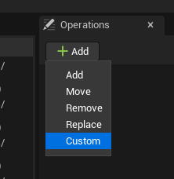

# Create a custom renaming operation in C++

Although there are [built-in operations](../usage/builtin-renaming-operation.md), you may need to add custom operations.
This guide will teach you how to add custom operations to the Batch Rename Tool.

## Link the module

The first step requires that you have an `Editor` module. If you do not have one, you will have to create it.

To link the Batch Rename Tool module to your module, add `BatchRenameTool` in the private dependencies of your module:

```cs title="CustomModule.Build.cs"
public class CustomModule : ModuleRules
{
    public CustomModule(ReadOnlyTargetRules Target) : base(Target)
    {
        ...

        PrivateDependencyModuleNames.AddRange(new string[]
        {
            ...
            "BatchRenameTool", // Add this line
        });

        ...
    }
}
```

:::caution

If you link the tool to a `Runtime` module, you will have problems when compiling your game.

:::

## Create the operation class

Now you have to create the operation. To do this, create an Unreal class inheriting the UBatchRenamingOperation class:

```cpp title="BatchRenamingOperation_Custom.h"
#include "BatchRenamingOperation.h" // Don't forget to include this header

UCLASS(NotBlueprintable)
class UBatchRenamingOperation_Custom : public UBatchRenamingOperation
{
    GENERATED_BODY()
public:
    UPROPERTY(EditAnywhere, Category = "Custom")
    FString Str;

    // Define your parameters as uproperties here

    virtual FText GetDisplayName_Implementation() const override;
    virtual FString Apply_Implementation(const FString&) const override;
};
```

Then you have to define the parameters of the operation as uproperties. You also need to override two functions:
- `FText GetDisplayName_Implementation() const`: This function returns a readable text that describes what the
  operation does based on the parameters.
- `FString Apply_Implementation(const FString&) const`: This function takes the name of the asset to rename as a
  parameter, applies the changes to it and returns the new name. For example, if the operation must prefix the name with
  `A_` and the function receives a string `TheAssetName`, this function will return `A_TheAssetName`.

```cpp title="BatchRenamingOperation_Custom.cpp"
#include "BatchRenamingOperation_Custom.h"

FText UBatchRenamingOperation_Custom::GetDisplayName_Implementation() const
{
	return FText::Format(NSLOCTEXT("BatchRenamingOperation_Custom", "DisplayName", "Custom {0}"), FText::FromString(Str));
}

FString UBatchRenamingOperation_Custom::Apply_Implementation(const FString& In) const
{
    FString Copy = In;

    // Modify the name here

    return Copy;
}
```

That's all that needs to be done for this class.

## Create the factory

To be able to add an operation in the operation list via the menu, you must create a factory class. To be able to add an
operation in the operation list via the menu, you must create a Factory class. This class is just to build your
operation object. Here is an example of a factory implementation:

```cpp title="BatchRenamingOperation_Custom.h"
UCLASS(NotBlueprintable)
class UBatchRenamingOperationFactory_Custom : public UBatchRenamingOperationFactory
{
    GENERATED_BODY()
public:
    inline FText GetDisplayName() const override
    {
        return FText::FromString("Custom"); // Returns the name that will be displayed in the Add menu.
    }

    inline TObjectPtr<UBatchRenamingOperation> Create() override
    {
        return NewObject<UBatchRenamingOperation_Custom>(); // This function returns a new instance of your operation class
    }
};
```

Once the factory class is created and implemented, compile your code. You can now use your custom operation.


