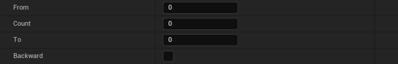

# Built-in renaming operations

The tool has built-in renaming operations. This document describes their function and how to use them.

You can write and use your own renaming operations with [this guide](../extending/create-a-custom-renaming-operation-cpp.md).

## Add

This operation adds a string `Str` to a specific position `Index` in the name.

## Remove

This operation removes a number `Count` of characters at a specific position `At` in the name.

## Replace

This operation search a string `Text to be Replaced` and replace it with another `Replace With`.

:::tip

You can use this operation to search and delete a string in the name. Just leave the field `Replace With` empty and fill
the field `Text to be Replaced` with the string to search.

:::

## Move

This operation move a number `Count` of characters from index `From` to index `to`.

