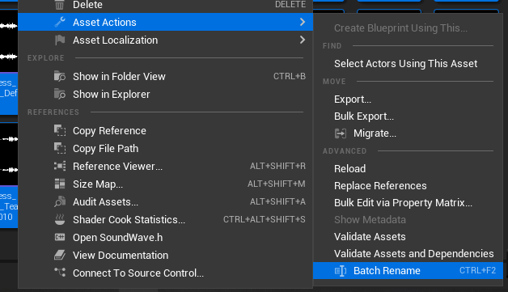
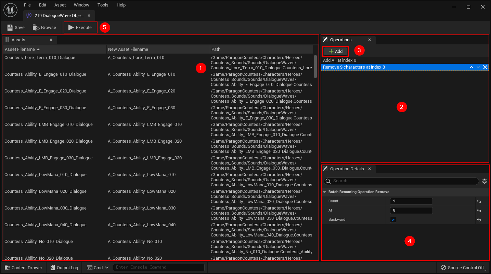

# Basic Usage

## Accessing the Batch Rename Tool

In the Content Browser, make a selection of assets, right-click, choose **Asset Actions**, then choose **Batch Rename** from the context menu.

## Using the Batch Rename Tool

The tool is divided into 3 parts:

- The **list of assets to rename** (1) which displays the current name of the asset, the preview of the name after renaming, and its path.
- The **list of operations** (2) to apply to rename an asset. The operations are executed sequentially starting with the first one at the top and ending with the last one at the bottom of the list. The display order is therefore important when renaming assets. You can add new operations to the list with the **Add button** (3), delete an operation with the cross to the right and change the order with the arrows.
- The **Operation Details panel** (4) to modify the selected operation parameters

Once you have configured your list of operations to perform, you can click on the **Execute button** (5). This will start the renaming of the files (it may take a while depending on the number of files).

:::info

The assets are only renamed by clicking on the Execute button. If you close the window without clicking on this button, the assets will not be renamed.

:::
