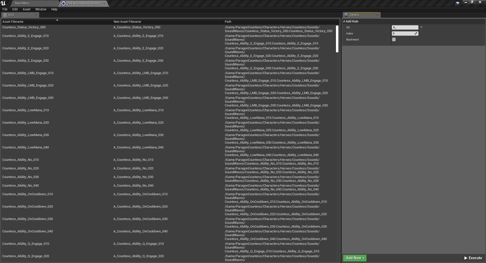

# Unreal Bulk Renamer

Unreal Engine 4 plug-in that adds a way to rename multiple assets.

## Supported Platforms

This plug-in was last built against **Unreal Engine 4.23**. It works on all platforms.

## Dependencies

This plug-in requires Visual Studio and either a C++ code project or a the full
Unreal Engine 4 source code from GitHub. 

## Usage

You can use this plug-in as a project plug-in, or an Engine plug-in.

If you use it as a project plug-in, clone this repository into your project's
*/Plugins* directory and compile your game in Visual Studio. A C++ code project
is required for this to work.

If you use it as an Engine plug-in, clone this repository into the
*/Engine/Plugins/Media* directory and compile your game. Full Unreal Engine 4
source code from GitHub is required for this.

This plug-in is enabled by default, so no need to enable it in the plug-in browser.

## Extending

*TO DO*

## Authors

* **Yoann Potinet** - [intelligide](https://github.com/intelligide)

## License

This project is licensed under the MIT License - see the [LICENSE](LICENSE.md) file for details

## References

* [Introduction to UE4 Plugins](https://wiki.unrealengine.com/An_Introduction_to_UE4_Plugins)