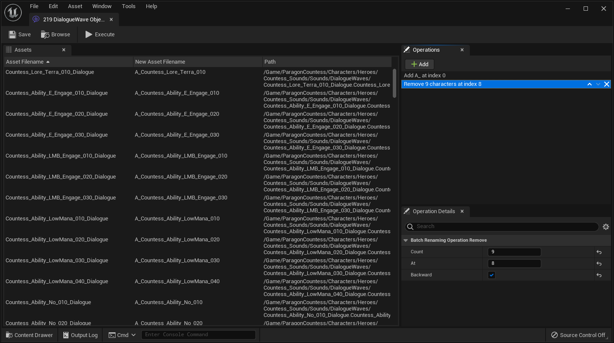

# Unreal Batch Rename Tool

A plugin to rename multiple assets quickly with a set of naming rules.

## Supported Platforms

This plug-in was last built against **Unreal Engine 5.0**. It works on all platforms.

## Documentation

[https://frozenstorminteractive.github.io/Unreal-Batch-Rename-Tool/](https://frozenstorminteractive.github.io/Unreal-Batch-Rename-Tool/)

## Authors

* **Yoann Potinet** - [intelligide](https://github.com/intelligide)

## License

This project is licensed under the MIT License - see the [LICENSE](LICENSE) file for details
